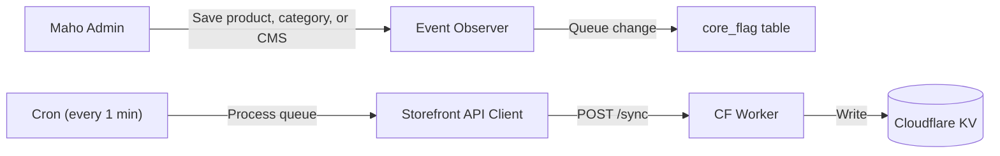

# Maho Admin Module

The `Mageaustralia_Storefront` module connects the Maho admin to the Cloudflare Workers storefront, keeping KV data in sync automatically.

## Overview



When a merchant saves a product, category, CMS page, or store config in the Maho admin, an event observer captures the change and queues it in the `core_flag` table. A cron job runs every minute to process the queue, pushing only the changed entities to Cloudflare KV via the Worker's `/sync` endpoint. This means **KV data is typically less than 1 minute behind the admin**.

## Event Observers

The module listens to 8 Maho events:

| Event | Trigger |
|-------|---------|
| `catalog_product_save_after` | Product created or updated |
| `catalog_product_delete_after` | Product deleted |
| `catalog_category_save_after` | Category created or updated |
| `catalog_category_delete_after` | Category deleted |
| `cms_page_save_after` | CMS page created or updated |
| `cms_page_delete_after` | CMS page deleted |
| `core_config_data_save_after` | Store config changed |
| `store_save_after` | Store view settings changed |

Each observer writes a debounced entry to the sync queue. Multiple saves of the same entity within a cron cycle are collapsed into a single sync operation.

## Sync Queue

The queue uses Maho's `core_flag` table:

```
Flag code: storefront_sync_queue
Flag data: JSON array of {type, id, action} entries
```

The cron job (`storefront_process_queue`) runs every minute:

1. Reads and clears the queue atomically
2. Groups changes by entity type
3. Calls the Worker's `/sync` endpoint for each group
4. Logs results to `storefront_activity_log` table

## API Clients

### Storefront API Client

`Model/Api/Storefront.php` — communicates with the Cloudflare Worker:

| Method | Endpoint | Purpose |
|--------|----------|---------|
| `syncProducts($ids)` | `POST /sync` | Push product data to KV |
| `syncCategories($ids)` | `POST /sync` | Push category data to KV |
| `syncCmsPages($ids)` | `POST /sync` | Push CMS pages to KV |
| `syncConfig()` | `POST /sync` | Push store config to KV |
| `fullSync()` | `POST /sync` | Full catalog sync |
| `purgeCache($urls)` | `POST /cache/purge` | Purge edge-cached URLs |

### Cloudflare API Client

`Model/Api/Cloudflare.php` — communicates directly with the Cloudflare API:

| Method | Purpose |
|--------|---------|
| `listKvKeys($prefix)` | List KV keys by prefix |
| `deleteKvKeys($keys)` | Delete specific KV keys |
| `purgeZoneCache($urls)` | Purge Cloudflare zone cache |
| `createDnsRecord($name, $content)` | Add DNS record |

Uses Symfony HttpClient (not cURL or Prototype.js).

## Admin Dashboard

The module adds an admin section under **System > Storefront** with four controllers:

### Dashboard
Overview of sync status, last sync time, KV key count, and recent activity log.

### Sync Controller
Step-by-step sync interface:
- **Quick Sync** — process pending queue items
- **Full Sync** — re-sync all catalog data (products, categories, CMS, config)
- **Selective Sync** — sync specific entity types

### Cache Controller
- **Purge URLs** — purge specific edge-cached URLs
- **Purge All** — purge entire edge cache via Cloudflare API
- **Delete KV Keys** — remove specific keys from KV

### Onboard Controller
Multi-step provisioning for new stores:
1. Create DNS record (CNAME to Workers)
2. Configure Worker routes
3. Initial full sync
4. Verify storefront responds

Includes automatic rollback on failure.

## Activity Logging

All sync operations are logged to the `storefront_activity_log` table:

| Column | Description |
|--------|-------------|
| `action` | sync, purge, delete, onboard |
| `entity_type` | product, category, cms_page, config |
| `entity_ids` | JSON array of affected IDs |
| `status` | success, error |
| `message` | Result details or error message |
| `created_at` | Timestamp |

## Configuration

Admin config under **System > Configuration > Mageaustralia > Storefront**:

| Field | Description |
|-------|-------------|
| Storefront URL | Worker URL (e.g., `https://demo.mageaustralia.com.au`) |
| Sync Secret | Shared secret for authenticating sync requests |
| Cloudflare API Key | For direct CF API operations |
| Cloudflare Email | CF account email |
| Cloudflare Zone ID | For cache purge and DNS operations |
| Auto Sync Enabled | Enable/disable observer-driven sync |
| Sync Cron Schedule | Cron expression (default: `* * * * *`) |

Source: `app/code/local/Mageaustralia/Storefront/`
