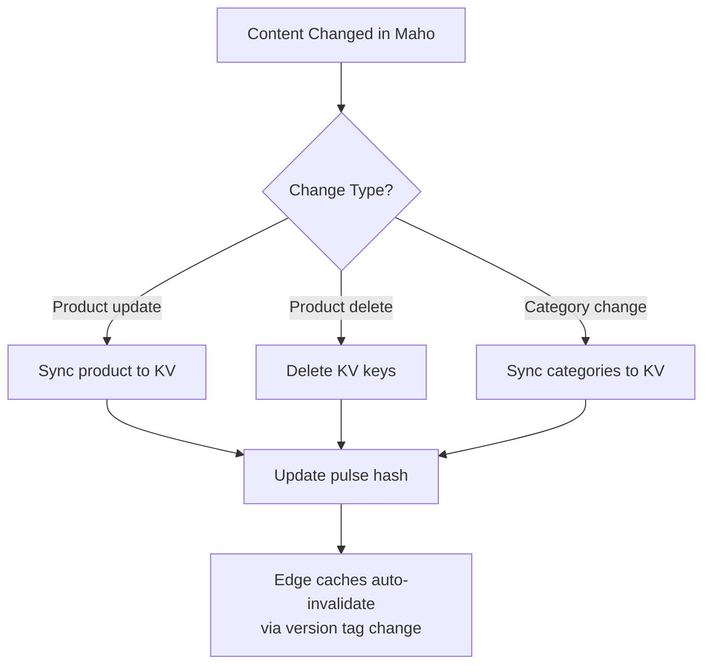

# Cache Management

Endpoints for managing cached data in KV and the edge cache.

## Update KV Entry

Update specific keys in KV without a full sync.

```bash
POST /cache/update
Content-Type: application/json

{
  "secret": "your-sync-secret",
  "key": "en:product:tori-tank",
  "value": { ... },
  "ttl": 86400
}
```

| Field | Type | Required | Description |
|-------|------|----------|-------------|
| `secret` | string | Yes | Sync secret |
| `key` | string | Yes | KV key to update |
| `value` | any | Yes | JSON value to store |
| `ttl` | number | No | Expiration in seconds (omit for permanent) |

## Purge Edge Cache

Purge edge-cached HTML for specific URLs.

```bash
POST /cache/purge
Content-Type: application/json

{
  "secret": "your-sync-secret",
  "urls": [
    "/women",
    "/tori-tank"
  ]
}
```

| Field | Type | Required | Description |
|-------|------|----------|-------------|
| `secret` | string | Yes | Sync secret |
| `urls` | string[] | Yes | URL paths to purge from edge cache |

This uses the Cloudflare Cache API to delete cached responses. The next request to those URLs will re-render from KV data.

## Delete KV Keys

Remove specific keys from KV storage.

```bash
POST /cache/delete
Content-Type: application/json

{
  "secret": "your-sync-secret",
  "keys": [
    "en:product:discontinued-item",
    "en:products:category:5:page:1"
  ]
}
```

| Field | Type | Required | Description |
|-------|------|----------|-------------|
| `secret` | string | Yes | Sync secret |
| `keys` | string[] | Yes | KV keys to delete |

## Cache Invalidation Strategy



For targeted invalidation without a full sync:

1. Update the specific KV entry via `/cache/update`
2. Purge the edge cache for affected URLs via `/cache/purge`
3. The freshness controller will handle eventual consistency for any missed pages

Source: `src/index.tsx`
