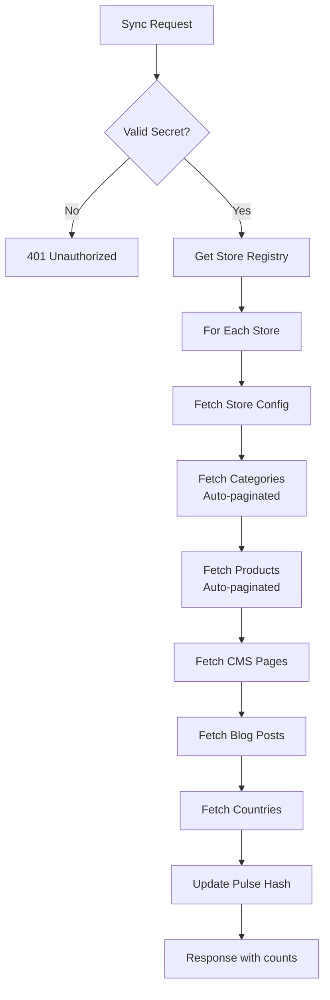

# Sync Endpoint

The `/sync` endpoint populates Cloudflare KV with catalog data from the Maho backend. It's called by the admin module (Mageaustralia_Storefront) or via cron to keep the storefront's data current.

## Full Sync

Syncs all entity types for all stores.

```bash
curl -X POST https://your-store.com/sync \
  -H "Content-Type: application/json" \
  -d '{"secret": "your-sync-secret"}'
```

**Response:**

```json
{
  "success": true,
  "synced": {
    "config": 1,
    "categories": 42,
    "products": 1523,
    "cmsPages": 8,
    "blogPosts": 12,
    "countries": 1
  },
  "duration": "4.2s"
}
```

## Partial Sync

Sync a specific entity type only.

| Endpoint | Entities |
|----------|----------|
| `POST /sync/config` | Store config (name, currency, locale, etc.) |
| `POST /sync/categories` | All active categories with product counts |
| `POST /sync/products` | All products (paginated, all pages) |
| `POST /sync/cms-pages` | All CMS pages |
| `POST /sync/blog-posts` | All blog posts |
| `POST /sync/countries` | Country list with regions |

```bash
# Sync only products
curl -X POST https://your-store.com/sync/products \
  -H "Content-Type: application/json" \
  -d '{"secret": "your-sync-secret"}'
```

## Sync Process



## KV Key Patterns

During sync, data is written to KV with store-prefixed keys:

| Key | Content |
|-----|---------|
| `{store}:config` | StoreConfig JSON |
| `{store}:categories` | Category tree JSON array |
| `{store}:product:{urlKey}` | Individual product JSON |
| `{store}:products:category:{id}:page:{n}` | Category product listing page |
| `{store}:cms:{identifier}` | CMS page content |
| `{store}:blog:{identifier}` | Blog post content |
| `{store}:countries` | Country list with regions |
| `pulse` | Data version hash (triggers edge cache bust) |

## Pulse Hash

After every sync, the `pulse` KV key is updated with a new hash. This hash is combined with `ASSET_HASH` to form the edge cache version tag — any change in pulse automatically invalidates all edge-cached HTML pages.

## Product Sync Details

Products are fetched in pages of 100 via auto-pagination:

1. `MahoApiClient.fetchAllPages('/products?itemsPerPage=100')`
2. Each product is stored individually: `{store}:product:{urlKey}`
3. Products are also grouped by category for listing pages

For large catalogs (1000+ products), full sync can take several seconds. Use partial syncs for targeted updates.

## Admin Module Integration

The Maho admin module (`Mageaustralia_Storefront`) triggers syncs automatically:

- **On product save** → partial product sync
- **On category save** → partial category sync
- **On CMS page save** → partial CMS sync
- **Cron job** → full sync on schedule
- **Manual** → "Sync Now" button in admin

Source: `src/index.tsx`, `src/api-client.ts`
