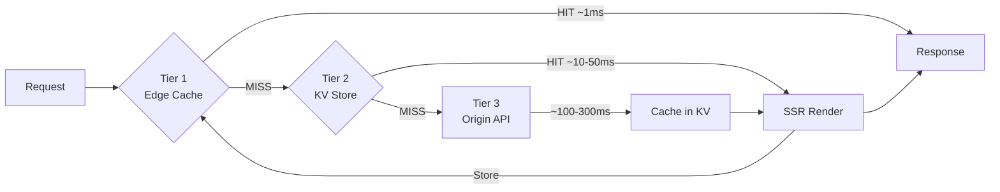
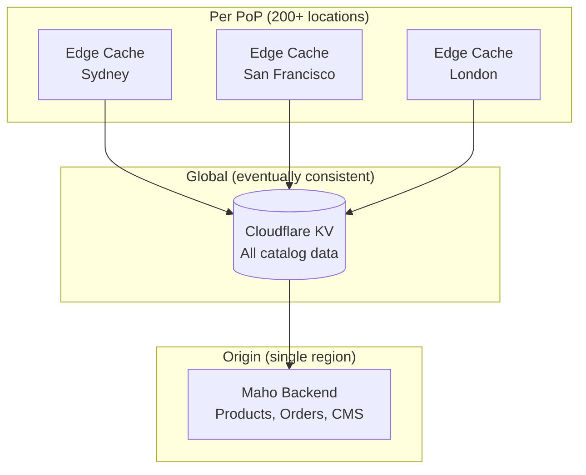

# Caching

The Maho Storefront uses a three-tier caching strategy to deliver sub-100ms responses globally while keeping content fresh.


## Cache Tiers



### Tier 1: Cloudflare Edge Cache

HTML responses are cached at each Cloudflare PoP (Point of Presence). Each PoP maintains its own cache - a cache in Sydney doesn't serve requests routed to Singapore.

**TTLs by content type:**

| Content | Edge TTL | Rationale |
|---------|----------|-----------|
| Homepage | 30 min | Frequently updated promotions |
| Category pages | 2 hours | Product additions/removals |
| Product pages | 4 hours | Price/stock changes less frequent |
| CMS pages | 2 hours | Content updates |
| Blog posts | 4 hours | Rarely changed |
| Static assets (CSS/JS) | 1 year | Immutable, hash-versioned |

These TTLs are defined as constants at the top of `src/index.tsx` (~line 188) and can be adjusted per deployment:

```typescript
// src/index.tsx
const CACHE_HOME     = 1800;   // 30 min
const CACHE_CATEGORY = 7200;   // 2 hours
const CACHE_PRODUCT  = 14400;  // 4 hours
const CACHE_CMS      = 7200;   // 2 hours
const CACHE_BLOG     = 14400;  // 4 hours
```

::: tip
These TTLs can safely be extended (e.g. to 7 days) because the [freshness controller](/architecture/freshness) detects stale content on every page load, and [observer-driven sync](/admin-module/) auto-invalidates edge caches whenever data changes in the admin. The TTL is a ceiling, not a guarantee of staleness.
:::

**Browser headers:**

```
Cache-Control: no-cache
ETag: "v1abc.p2def"
```

The `no-cache` directive forces browsers to revalidate with the edge on every request, but the ETag allows `304 Not Modified` responses when content hasn't changed.

### Tier 2: Cloudflare KV

All catalog data is stored in Cloudflare KV with store-prefixed keys:

| Key Pattern | Data |
|-------------|------|
| `{store}:config` | Store configuration |
| `{store}:categories` | Category tree |
| `{store}:product:{urlKey}` | Individual product |
| `{store}:products:category:{id}:page:{n}` | Product listing page |
| `{store}:cms:{identifier}` | CMS page content |
| `{store}:blog:{identifier}` | Blog post |
| `{store}:countries` | Country list |

**TTL behavior:**

- **Sync-written data** (via `/sync` endpoint): No TTL - persists until next sync
- **Fallback-fetched data** (on KV miss): 24-hour TTL

### Tier 3: Origin API

The Maho backend is the source of truth. It's accessed via `MahoApiClient` when:

1. KV doesn't have the requested data
2. A freshness check determines the data is stale
3. A full sync is triggered

## Cache Invalidation

### Event-Driven Sync (Primary)

The [Maho admin module](/admin-module/) keeps KV current automatically. Any product, category, CMS page, or config save in the Maho admin fires an observer that queues a sync. A cron job processes the queue every minute, pushing only the changed entities to KV. This means **KV data is typically less than 1 minute behind the admin**.

### Automatic Edge Invalidation

Edge cache invalidates automatically when the version tag changes:

```
Version Tag = ASSET_HASH.pulseHash
```

- **Code deploy** → `ASSET_HASH` changes → all edge caches miss
- **Data sync** → `pulseHash` changes → all edge caches miss

### Manual Invalidation

The `/cache/purge` endpoint purges specific URLs or patterns:

```bash
curl -X POST https://your-store.com/cache/purge \
  -H "Content-Type: application/json" \
  -d '{"secret": "your-secret", "urls": ["/product-url"]}'
```

### Freshness Controller

Client-side JavaScript checks if the currently displayed page is still fresh by comparing version fingerprints. If stale, a background revalidation is triggered - the user sees the cached version immediately, and the next request gets fresh content.

See [Freshness](/architecture/freshness) for details.

## Never-Cached Routes

User-specific pages are never cached at any tier:

- `/cart` - Cart contents
- `/checkout` - Checkout flow
- `/account/*` - Account dashboard
- `/search` - Search results
- `/login`, `/register` - Authentication

These routes always execute the Worker handler, hitting KV for catalog data but rendering with real-time cart/account state.

## Cache Architecture by Layer



Source: `src/index.tsx`, `CACHING.md`
