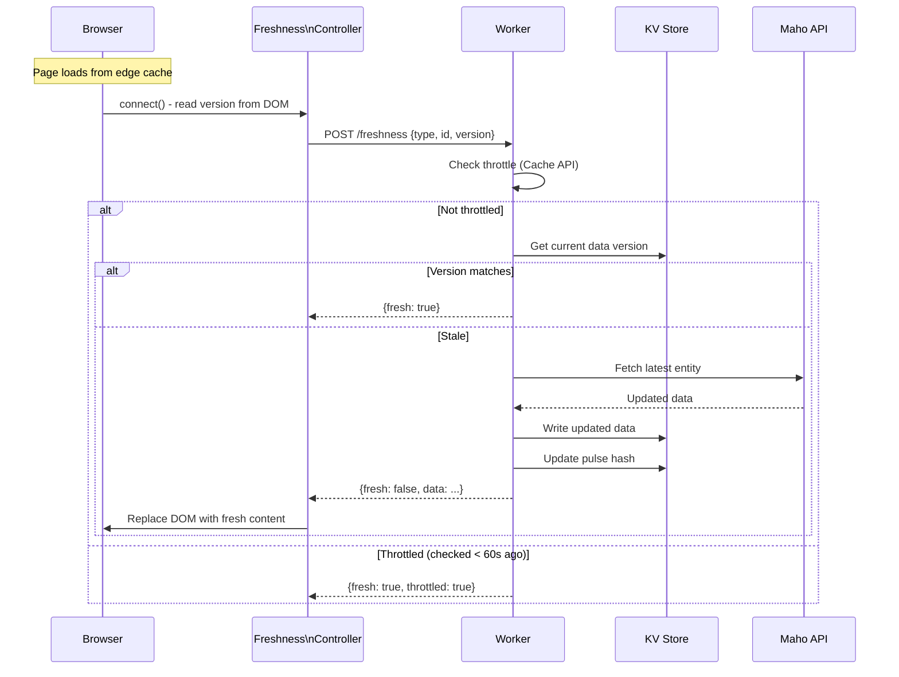

# Freshness Detection

The freshness system ensures edge-cached pages stay current without sacrificing performance. It works by embedding version fingerprints in rendered HTML and using client-side JavaScript to trigger background revalidation when data is stale.

## How It Works



## Version Fingerprints

When the Worker renders a page, it embeds a version hash in the HTML:

```html
<div data-controller="freshness"
     data-freshness-type-value="product"
     data-freshness-id-value="tori-tank"
     data-freshness-version-value="a1b2c3d4">
</div>
```

The version hash is computed from the entity's data at render time. If the origin data changes (price update, stock change, content edit), the hash will differ.

## Throttling

To prevent excessive API calls, the Worker throttles freshness checks:

- **Scope:** Per URL, per Cloudflare PoP
- **Window:** Maximum 1 revalidation per 60 seconds
- **Mechanism:** Cloudflare Cache API stores a "last checked" timestamp
- **Effect:** Even with thousands of visitors, each page generates at most ~1 origin call per minute per PoP

## User Experience

The freshness check is invisible to users:

1. User sees the edge-cached page immediately (fast)
2. Freshness controller runs in the background (non-blocking)
3. If stale, an API call is made to Maho and the **DOM is replaced in-place** if the data has changed - the current user sees the update without a reload
4. Data is updated in KV and edge cache is busted
5. The **next** visitor to that URL gets the fresh version server-rendered

Worst case: content is ~60 seconds stale. Best case: content is always fresh (no changes on origin).

## Freshness by Entity Type

| Entity | What Triggers Staleness | Typical Lag |
|--------|------------------------|-------------|
| Product | Price change, stock update, description edit | < 60s |
| Category | Product added/removed, position change | < 60s |
| CMS Page | Content update in admin | < 60s |
| Blog Post | Content update | < 60s |

## Relationship to Caching

Freshness is a **safety net**, not the primary update mechanism.

The primary path for keeping data current is the [Maho admin module](/admin-module/) - any product, category, or CMS save in Maho triggers an observer that queues a KV update. A cron job processes the queue every minute, pushing changes directly to Cloudflare KV via the `/sync` endpoint. This means **KV should never be stale under normal operation**.

Freshness exists to catch edge cases:

- **Edge cache staleness** - HTML is cached per PoP with TTLs of 30 min to 4 hours. Even though KV has the latest data, a PoP may be serving an old HTML render. The freshness controller detects this and triggers a re-render.
- **Missed syncs** - If the cron queue fails or a sync is delayed, freshness catches the discrepancy.
- **External data changes** - Changes made outside the admin (direct DB edits, API imports) won't trigger observers.

In practice: KV is kept current by observer-driven sync, edge cache is kept current by freshness checks, and both work together for sub-minute propagation.

Source: `src/index.tsx`, `src/js/controllers/freshness-controller.js`
