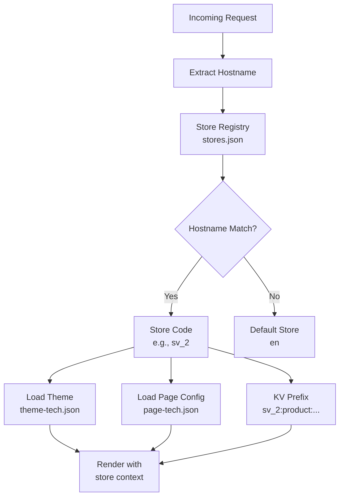

# Multi-Store Architecture

A single Maho Storefront Worker deployment can serve multiple stores, each with its own theme, component configuration, and isolated catalog data.

| Fashion Store | Tech Store |
|:--:|:--:|
|  |  |

## Store Resolution



## Configuration

### stores.json

Maps store codes to theme and page config files:

```json
{
  "stores": {
    "en": {
      "theme": "maho",
      "pageConfig": "page.json"
    },
    "sv_2": {
      "theme": "tech",
      "pageConfig": "page-tech.json"
    },
    "store_view_3": {
      "theme": "brew-beyond",
      "pageConfig": "page-brew-beyond.json"
    }
  },
  "defaultTheme": "maho",
  "defaultPageConfig": "page.json"
}
```

### Store Registry

The store registry maps hostnames to store codes. It can be stored in KV (key: `_stores`) or configured as a Wrangler environment variable (`DEMO_STORES`):

```json
[
  {"code": "en", "name": "Fashion", "url": "https://demo.example.com"},
  {"code": "sv_2", "name": "TechZone", "url": "https://demo2.example.com"},
  {"code": "store_view_3", "name": "Cafe", "url": "https://cafe.example.com"}
]
```

### Multi-Domain API URLs

By default all stores share a single Maho backend (`MAHO_API_URL`). For multi-domain setups where each store has its own backend, add an `apiUrl` per store:

```json
[
  {"code": "en", "name": "Fashion", "url": "https://www.domain1.com", "apiUrl": "https://api.domain1.com"},
  {"code": "sv_2", "name": "TechZone", "url": "https://www.domain2.com", "apiUrl": "https://api.domain2.com"}
]
```

When `apiUrl` is omitted, the store falls back to the global `MAHO_API_URL` binding. This keeps single-backend setups simple — just omit `apiUrl` from all entries.

The per-store API URL is used for:
- All API client requests (product, category, CMS, blog fetches)
- Media proxying (`/media/*` paths)
- Admin redirect (`/admin` → backend admin panel)
- Client-side `window.MAHO_API_URL` (cart, checkout, search JS)

## Data Isolation

Each store's data is isolated in KV via key prefixes:

| Store | Key Example | Content |
|-------|-------------|---------|
| `en` | `en:product:tori-tank` | English store product |
| `sv_2` | `sv_2:product:tori-tank` | Tech store product |
| `en` | `en:config` | English store config |
| `sv_2` | `sv_2:config` | Tech store config |

This ensures:
- Products can have different prices per store
- Categories can be structured differently
- CMS content is store-specific
- Config (currency, locale) varies per store

## Render Context

Before rendering any page, the store context is set:

```typescript
// In route handler
const storeCode = getCurrentStoreCode(hostname, storeRegistry);
setRenderStore(storeCode);

// All components now use this store's config
const variant = getVariant('product', 'gallery'); // Uses store's page config
```

The render context is a module-level variable — set once per request, read by all components during synchronous SSR.

## Theme Switching

Each store renders with its theme's CSS custom properties:

```html
<!-- Store "sv_2" renders with tech theme -->
<html data-theme="tech">
```

The `[data-theme="tech"]` selector activates the tech theme's CSS custom properties, overriding the default `:root` values. All DaisyUI components and utility classes automatically use the store's colors, fonts, and spacing.

## Available Themes

### Custom Themes

Create a `theme-{name}.json` file with full control over colors, fonts, typography, spacing, radii, and component styles. See `theme.json` for the schema.

### Pre-baked Color Themes

18 ready-to-use color themes are included in `palette-themes.json`. These provide DaisyUI semantic color mappings that work out of the box:

**Light themes:** Sunrise, Amethyst, Skyline, Caramel, Ocean, Terracotta, Botanical, Coral, Harvest, Sandstone, Coastal, Electric, Autumn Hunt, Tropical, Citrus

**Dark themes:** Neon Dream, Cobalt, Charcoal

To use a pre-baked theme, reference its name in `stores.json`:

```json
{
  "stores": {
    "en": { "theme": "coastal", "pageConfig": "page.json" }
  }
}
```

Pre-baked themes only set colors. They inherit the default theme's fonts, typography, spacing, and component styles.

## Adding a New Store

1. Add the store code and configuration to `stores.json`
2. Choose a theme — use a pre-baked theme name or create a `theme-{name}.json`
3. Create a page config (`page-{name}.json`) if needed
4. Add hostname → store code mapping to the store registry
5. Sync data for the new store: `POST /sync` (will fetch data for all registered stores)
6. Rebuild CSS: `bun run build:css` (generates new theme CSS)
7. Deploy: `./maho storefront:build --deploy`

Source: `src/index.tsx`, `src/page-config.ts`, `stores.json`, `palette-themes.json`
