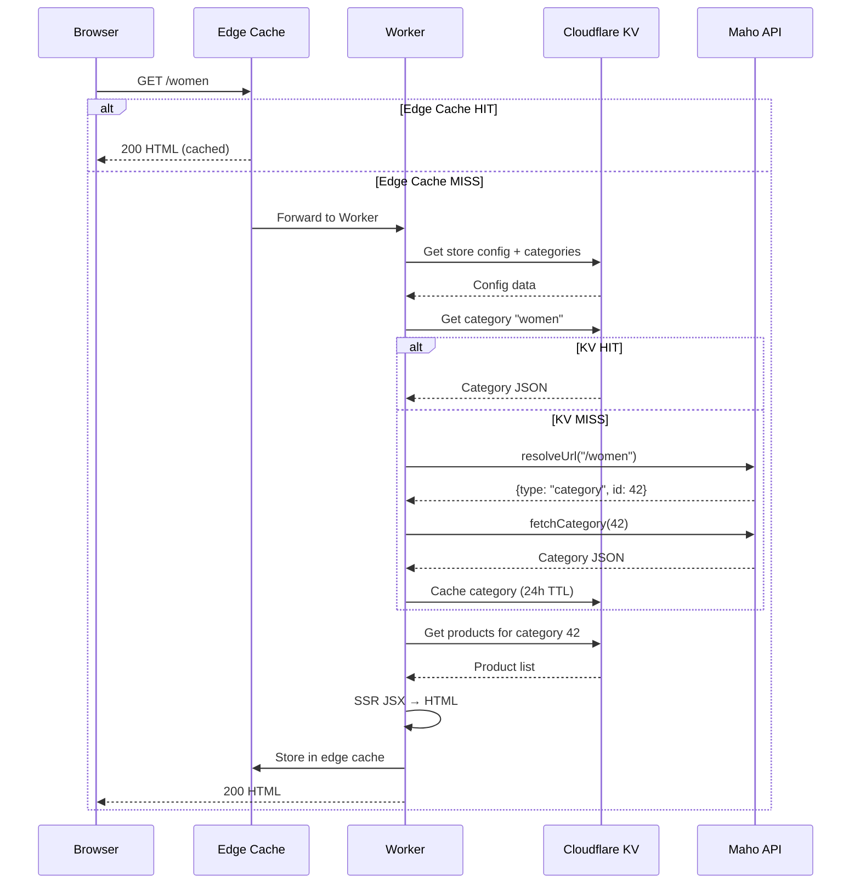

# Request Flow

Every request to the Maho Storefront follows a predictable path from the browser through the edge cache, KV store, and (if needed) the origin API.

## Request Lifecycle



## URL Resolution

When a request hits a URL that isn't in KV, the Worker uses the Maho API's URL resolver to determine the entity type:

```mermaid
flowchart LR
    URL[/"/:slug"] --> KVCheck{In KV?}
    KVCheck -->|Yes| Render[Render Page]
    KVCheck -->|No| Resolve[API: resolveUrl]
    Resolve --> Type{Entity Type?}
    Type -->|category| FetchCat[Fetch + Cache Category]
    Type -->|product| FetchProd[Fetch + Cache Product]
    Type -->|cms-page| FetchCMS[Fetch + Cache CMS Page]
    Type -->|blog-post| FetchBlog[Fetch + Cache Blog Post]
    Type -->|null| 404[404 Not Found]
    FetchCat --> Render
    FetchProd --> Render
    FetchCMS --> Render
    FetchBlog --> Render
```

## Route Table

| Route | Handler | Caching |
|-------|---------|---------|
| `GET /` | Homepage | Edge: 30 min |
| `GET /:slug` | Category/Product/CMS/Blog | Edge: 2-4 hours |
| `GET /cart` | Cart page | Never cached |
| `GET /checkout` | Checkout flow | Never cached |
| `GET /account/*` | Account pages | Never cached |
| `GET /search` | Search results | Never cached |
| `POST /freshness` | Freshness check | N/A |
| `POST /sync` | Data sync | N/A |
| `GET /styles.css` | CSS bundle | 1 year (immutable) |
| `GET /controllers.js` | JS bundle | 1 year (immutable) |
| `GET /media/*` | Media proxy | Proxy to backend |

## Edge Cache Versioning

Edge cache keys include a version tag composed of two parts:

```
{ASSET_HASH}.{pulseHash}
```

- **ASSET_HASH** - Hash of CSS + JS + page configs. Changes when code is deployed.
- **pulseHash** - Hash of the latest data sync timestamp from KV. Changes when catalog data is synced.

When either changes, all edge-cached pages automatically become stale, forcing a re-render with fresh data and assets.

## ETag Revalidation

Browser requests include `If-None-Match` headers. The Worker checks if the content version matches - if so, it returns `304 Not Modified` instead of the full HTML body, saving bandwidth.

## Rate Limiting

The Worker tracks 404 responses per IP using the Cloudflare Cache API:

- **Threshold:** 30 404s in 5 minutes
- **Action:** Block IP for 15 minutes with `429 Too Many Requests`
- **Purpose:** Bot protection against URL scanning

Source: `src/index.tsx`
