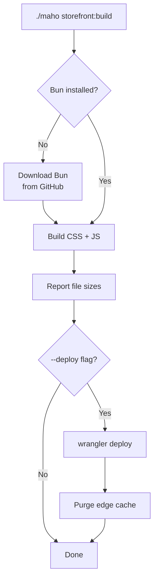

# Maho CLI - storefront:build

The Maho backend includes a CLI command that builds storefront assets using [Bun](https://bun.sh/). It auto-downloads Bun if not installed, runs CSS/JS builds, and optionally deploys to Cloudflare Workers with cache purging.

## Usage

```bash
./maho storefront:build [options]
```

## Options

| Option | Short | Description |
|--------|-------|-------------|
| `--path` | `-p` | Storefront project path (auto-detected if omitted) |
| `--css-only` | | Only build CSS |
| `--js-only` | | Only build JS |
| `--install` | `-i` | Run `bun install` before building |
| `--deploy` | `-d` | Deploy to Cloudflare Workers after build |
| `--update-bun` | | Force re-download of Bun binary |

## Examples

```bash
# Full build (CSS + JS)
./maho storefront:build

# Build and deploy
./maho storefront:build --deploy

# CSS only, with dependency install
./maho storefront:build --css-only --install

# Specify custom storefront path
./maho storefront:build --path /var/www/maho-storefront
```

## What It Does



### 1. Bun Resolution

The command finds Bun in this order:

1. **Project-local** - `.bun/bin/bun` in the storefront directory
2. **System PATH** - globally installed `bun`
3. **Auto-download** - downloads the correct binary from GitHub (Linux/macOS, x64/arm64)

Downloaded Bun is stored at `{storefront}/.bun/bin/bun` for future use.

### 2. Build

Runs `bun run build:css` and `bun run build:js`, which execute:

| Script | Command | Output |
|--------|---------|--------|
| `build:css` | UnoCSS scan + DaisyUI + theme tokens | `public/styles.css` |
| `build:js` | esbuild bundle + minify | `public/controllers.js.txt` |

After each build, file sizes are reported in human-readable format.

### 3. Deploy (with `--deploy`)

1. Reads Cloudflare credentials from `deploy.sh` in the storefront directory
2. Runs `bun x wrangler deploy -c wrangler.toml`
3. Purges Cloudflare edge cache for all configured hosts
4. Prewarms the edge cache (if `WARM_HOSTS` is configured)

### Storefront Path Resolution

If `--path` is not specified:

1. `STOREFRONT_PATH` environment variable
2. Auto-detect: `{maho-web-root}/../maho-storefront/`

This means on a standard Maho installation where the storefront lives next to the web root, no path configuration is needed.

## Manual Alternative

The same steps can be run directly with Bun:

```bash
cd maho-storefront

# Install dependencies
bun install

# Build assets
bun run build

# Deploy
bun run deploy

# Sync data from Maho backend to KV
curl -X POST https://your-store.com/sync \
  -H "Authorization: Bearer YOUR_SYNC_SECRET"
```

## Deploy Script

The `deploy.sh` script handles deployment to demo environments:

```bash
./deploy.sh
```

This script:
1. Runs `bun run build` (CSS + JS + plugin registry generation)
2. Deploys via `bun x wrangler deploy --config wrangler.toml`
3. Purges Cloudflare edge cache for all configured hostnames
4. Prewarms the edge cache by fetching all known URLs (categories, products, CMS pages, blog posts)

Cache warming is optional -- set `WARM_HOSTS` and `SYNC_SECRET` in `.env`:

```bash
SYNC_SECRET="your-sync-secret"
WARM_HOSTS='["https://your-store.com"]'
```

Source: `lib/MahoCLI/Commands/StorefrontBuild.php`, `deploy.sh`, `package.json`
