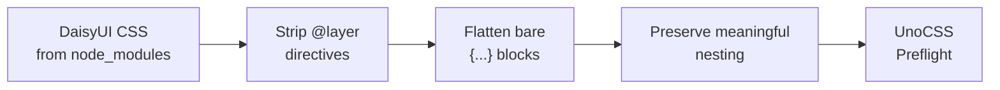

# UnoCSS

UnoCSS generates the CSS bundle by scanning all source files for utility classes and combining them with DaisyUI component styles and theme-generated custom properties.

**Config:** `uno.config.ts` (~556 lines)

## Build Command

```bash
bun run build:css
# Runs: unocss "src/**/*.tsx" "src/**/*.ts" "src/**/*.js" --out-file public/styles.css
```

## CSS Layers

The output CSS is organized in layers (via UnoCSS preflights):

```
1. DaisyUI v5 component CSS
2. DaisyUI theme variables (per-store)
3. CSS custom properties from theme.json
4. Base reset (box-sizing, typography, form elements)
5. Product/account page CSS (legacy component styles)
6. Semantic color overrides
7. UnoCSS atomic utility classes (generated from source scan)
```

## DaisyUI Processing

DaisyUI's CSS needs processing to work with UnoCSS instead of Tailwind:



The `processDaisyCSS()` function:

1. **Strips `@layer`** — UnoCSS manages its own layer system
2. **Flattens bare `&{...}`** — Stack-based phantom brace tracking handles DaisyUI's shorthand
3. **Preserves nesting** — `&:hover`, `&>.child`, `&:focus-visible` kept intact

## Theme Variable Generation

For each theme in `stores.json`, UnoCSS generates scoped CSS variables:

```typescript
// uno.config.ts reads theme files
const themes = loadThemes(stores); // theme.json, theme-tech.json, etc.

// Default theme → :root
// Named themes → [data-theme="name"]
```

**Generated output:**

```css
:root {
  --color-primary: #111;
  --font-sans: Sora, sans-serif;
  --radius-md: 8px;
  /* ... 100+ variables */
}

[data-theme="tech"] {
  --color-primary: #0a0a0a;
  --color-accent: #00d4ff;
  --font-sans: Roboto, sans-serif;
  /* Only overridden values */
}
```

## Semantic Color Overrides

DaisyUI uses its own color system. UnoCSS generates CSS variable-based overrides that bridge theme.json colors to DaisyUI's expectations:

```css
/* Map theme colors to utility classes */
.bg-primary { background-color: var(--color-primary); }
.text-primary { color: var(--color-primary); }
.border-primary { border-color: var(--color-primary); }

/* Opacity variants */
.bg-primary\/50 {
  background-color: color-mix(in srgb, var(--color-primary) 50%, transparent);
}
```

## Legacy CSS Preflights

Some component styles are too complex for utility classes alone. These are included as preflights:

| File | Lines | Content |
|------|-------|---------|
| `src/css/product.css` | ~1250 | Product gallery, options, sticky ATC |
| `src/css/responsive.css` | ~150 | Product/account responsive overrides |
| `src/css/cart.css` | ~850 | Cart/checkout layout |
| `src/css/account.css` | ~1080 | Account dashboard |
| `src/css/checkout.css` | ~625 | Payment forms, step indicator |

These are gradually being replaced with DaisyUI classes and UnoCSS utilities.

## Breakpoints

Breakpoints from `theme.json` are mapped to UnoCSS breakpoints:

| Prefix | Width | theme.json key |
|--------|-------|----------------|
| `sm:` | 480px | `breakpoints.sm` |
| `md:` | 640px | `breakpoints.md` |
| `lg:` | 768px | `breakpoints.lg` |
| `xl:` | 1024px | `breakpoints.xl` |
| `2xl:` | 1280px | `breakpoints.2xl` |

Source: `uno.config.ts`
