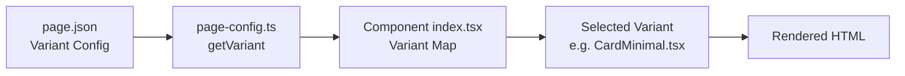

# Component Variant System

The Maho Storefront uses a slot-based component architecture where each UI element has multiple interchangeable variants. Which variant renders is controlled by `page.json` configuration — no code changes needed to swap a product card style or change the header layout.

## How It Works



1. **page.json** declares which variant to use for each slot per page type
2. **`getVariant(page, slot)`** resolves the variant name at render time
3. **Component `index.tsx`** maps variant names to implementations
4. The selected variant component renders

## Domains and Slots

Components are organized into 8 domains with 36+ slots:

| Domain | Slots | Example Variants |
|--------|-------|-----------------|
| **product-display** | card, gallery, layout, variant-picker, price, tabs, badge, quantity-stepper, sticky-atc, stock-indicator, info-panel, breadcrumb, recently-viewed | CardStandard, CardMinimal, GalleryCarousel, GalleryGrid |
| **product-utility** | wishlist-button, shipping-estimator, size-guide, notify-me, compare, delivery-date | — |
| **cart** | drawer, line-item, summary, coupon-field, progress-bar | DrawerSlide |
| **category** | grid, hero, toolbar, banner-inline, subcategory-tiles | — |
| **filtering** | sidebar, price-range, sort-select, pagination, chip-bar | — |
| **homepage** | hero, promo-grid, promo-banner, featured-products, icon-features, countdown-timer, shop-by-category, brand-logo-strip, collection-spotlight, promo-strip | — |
| **navigation** | header, footer, breadcrumb, mobile-drawer | HeaderSticky, FooterStandard |
| **checkout** | address-form, order-summary, payment-block, step-indicator, trust-badges | — |

## File Structure

Each slot follows this pattern:

```
src/templates/components/{domain}/{slot}/
├── _manifest.json       # Variant definitions
├── index.tsx            # Variant resolver + imports
├── VariantA.tsx         # Variant implementation
├── VariantB.tsx         # Another variant
└── ...
```

### `_manifest.json`

Declares available variants and the default:

```json
{
  "slot": "card",
  "domain": "product-display",
  "description": "Product card shown in category grids and search results",
  "variants": {
    "standard": {
      "label": "Standard Card",
      "description": "Full-featured card with image, price, ratings, and quick-add button",
      "file": "CardStandard.tsx"
    },
    "minimal": {
      "label": "Minimal Card",
      "description": "Borderless card with image zoom on hover, no quick-add button",
      "file": "CardMinimal.tsx"
    }
  },
  "default": "standard"
}
```

### `index.tsx`

Maps variant names to component implementations:

```tsx
import { getVariant } from '../../../page-config';
import CardStandard from './CardStandard';
import CardMinimal from './CardMinimal';

const variants = {
  standard: CardStandard,
  minimal: CardMinimal,
};

export default function ProductCard(props) {
  const variant = getVariant('product', 'card', 'standard');
  const Component = variants[variant] || CardStandard;
  return <Component {...props} />;
}
```

## Variant Resolution

The `getVariant()` function in `page-config.ts` resolves variants with this priority:

1. Store-specific `page-{name}.json` for the current render context
2. Default `page.json`
3. Fallback argument passed to `getVariant()`

```typescript
// In a component
const gallery = getVariant('product', 'gallery', 'carousel');
// Returns: "masonry" (from page.json) or "carousel" (fallback)
```

## Generated Manifest

Run `bun run manifest` to generate `manifest.json` from all `_manifest.json` files. This manifest provides:

- Complete inventory of all slots and variants
- Theme schema (from `theme.json`)
- Page config schema (from `page.json`)

Useful for tooling, documentation, and LLM context.

## Next Steps

- [page.json Reference](/components/page-config) — configure variant selection
- [Creating a Variant](/components/creating-a-variant) — add a new variant step by step
- [Product Display](/components/product-display) — product cards, galleries, tabs
- [Navigation](/components/navigation) — header and footer variants
