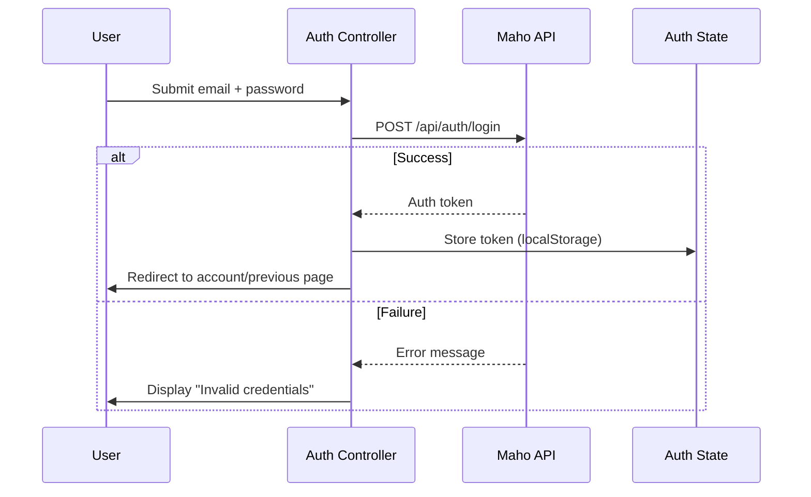

# Auth Controllers

Two controllers manage authentication: `auth` for login/register/password flows and `auth-state` for persistent auth state.

## Auth Controller

**Source:** `src/js/controllers/auth-controller.js` (~300 lines)

### Actions

| Action | Trigger | Behavior |
|--------|---------|----------|
| `login` | Submit login form | POST credentials, set auth token |
| `register` | Submit register form | POST new account, auto-login |
| `forgotPassword` | Submit email form | POST password reset request |
| `logout` | Click logout | Clear auth token, redirect to home |
| `toggleForm` | Click "Sign Up" / "Sign In" | Switch between login and register forms |

### Login Flow



### Registration

Registration creates a new customer account and auto-logs in:

1. Validates email, password, name fields
2. POST to `/api/customers` to create account
3. Auto-login with the new credentials
4. Redirect to account dashboard

## Auth State Controller

**Source:** `src/js/controllers/auth-state-controller.js` (~70 lines)

A lightweight controller that manages persistent auth state across page loads.

### Responsibilities

- Reads auth token from `localStorage` on `connect()`
- Sets auth headers for all subsequent API calls
- Updates UI elements based on auth state (show/hide account links)
- Listens for `auth:changed` custom events

### Usage in HTML

```html
<div data-controller="auth-state">
  <!-- Shown when logged in -->
  <a data-auth-state-target="authenticated" class="hidden"
     href="/account">My Account</a>

  <!-- Shown when logged out -->
  <a data-auth-state-target="guest"
     href="/login">Sign In</a>
</div>
```

The controller toggles visibility of `authenticated` and `guest` targets based on whether an auth token exists in localStorage.

Source: `src/js/controllers/auth-controller.js`, `src/js/controllers/auth-state-controller.js`
