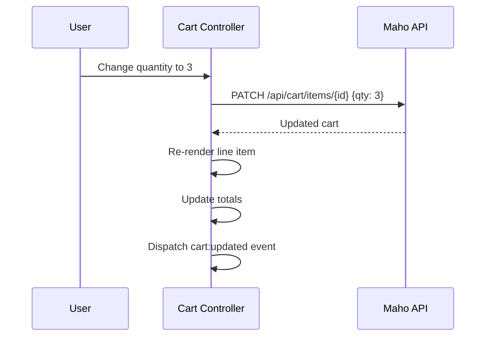

# Cart Controllers

Two controllers manage cart functionality: `cart` for the full cart page and `cart-drawer` for the slide-out mini cart.

## Cart Controller

**Source:** `src/js/controllers/cart-controller.js` (~600 lines)

Manages the full cart page with item editing, quantity updates, and coupon/gift card application.

### Targets

| Target | Element | Purpose |
|--------|---------|---------|
| `itemList` | Cart items container | Renders cart line items |
| `subtotal` | Subtotal display | Cart subtotal |
| `grandTotal` | Grand total display | Total after tax/discounts |
| `couponInput` | Coupon code input | Apply coupon codes |
| `couponMessage` | Feedback area | Success/error messages |
| `emptyMessage` | Empty cart notice | Shown when cart is empty |
| `checkoutButton` | Proceed to checkout | Disabled when cart empty |

### Key Actions

| Action | Behavior |
|--------|----------|
| `updateQty` | PATCH item quantity, re-render totals |
| `removeItem` | DELETE item from cart |
| `applyCoupon` | POST coupon code |
| `removeCoupon` | DELETE applied coupon |

### Cart API Flow



## Cart Drawer Controller

**Source:** `src/js/controllers/cart-drawer-controller.js` (~600 lines)

Manages the slide-out cart drawer that appears when items are added.

### Targets

| Target | Element | Purpose |
|--------|---------|---------|
| `drawer` | Drawer container | Slide-in panel |
| `backdrop` | Overlay | Click to close |
| `items` | Item list | Mini cart items |
| `total` | Total display | Cart total |
| `badge` | Cart count badge | Item count in header |

### Key Actions

| Action | Behavior |
|--------|----------|
| `open` | Slide drawer in from right |
| `close` | Slide drawer out, remove backdrop |
| `removeItem` | Remove item and re-render |

### Events

The cart drawer listens for custom events:

```javascript
// Dispatched by product controller after add-to-cart
document.dispatchEvent(new CustomEvent('cart:updated', { detail: { cart } }));

// Cart drawer catches it and opens with updated contents
```

### Drawer Animation

The drawer uses CSS transitions:

```css
.cart-drawer {
  transform: translateX(100%);
  transition: transform var(--transition-base) ease;
}
.cart-drawer.open {
  transform: translateX(0);
}
```

Source: `src/js/controllers/cart-controller.js`, `src/js/controllers/cart-drawer-controller.js`
