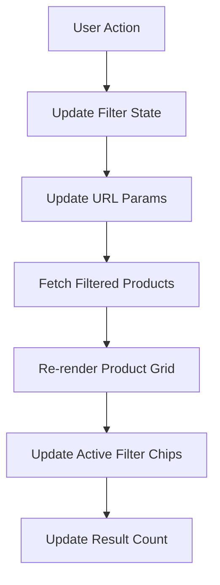

# Category & Filter Controller

The category filter controller manages product listing pages — filtering, sorting, price ranges, pagination, and mobile filter UI.

**Source:** `src/js/controllers/category-filter-controller.js` (~900 lines)

## Targets

| Target | Element | Purpose |
|--------|---------|---------|
| `productGrid` | Product grid container | Updated with filtered results |
| `filterSidebar` | Sidebar filter panel | Show/hide on mobile |
| `activeFilters` | Active filter chips | Display current filters |
| `priceMin` | Price range min input | Minimum price value |
| `priceMax` | Price range max input | Maximum price value |
| `priceSlider` | Dual-thumb slider | Visual price range selector |
| `sortSelect` | Sort dropdown | Order by price, name, etc. |
| `pagination` | Pagination controls | Page navigation |
| `resultCount` | Results counter | "Showing X of Y products" |
| `toolbar` | Top toolbar | Sort + view options |

## Values

| Value | Type | Description |
|-------|------|-------------|
| `categoryId` | Number | Current category ID |
| `filters` | String (JSON) | Active filter state |
| `sort` | String | Current sort field |
| `page` | Number | Current page number |
| `totalPages` | Number | Total pages available |

## Actions

| Action | Trigger | Behavior |
|--------|---------|----------|
| `toggleFilter` | Click filter option | Add/remove filter, reload products |
| `clearFilter` | Click chip X button | Remove specific filter |
| `clearAll` | Click "Clear All" | Reset all filters |
| `setSort` | Change sort dropdown | Re-sort product listing |
| `setPage` | Click page number | Navigate to page |
| `setPriceRange` | Slider drag or input | Filter by price range |
| `toggleMobileFilters` | Click filter button | Show/hide mobile filter sidebar |

## Filter Flow

Filters are applied client-side by fetching from the Worker with query parameters. The URL updates to reflect filter state, making filtered views shareable and bookmarkable.

## Price Range Slider

The dual-thumb price range slider:

- Two `<input type="range">` elements overlaid on a shared track
- CSS custom properties position the fill between the thumbs
- Debounced input — waits 300ms after the user stops dragging before fetching
- Supports both slider interaction and manual min/max text input

## Mobile Filter UX

On mobile devices:

1. Filters hide behind a "Filter" button in the toolbar
2. Clicking opens a slide-in sidebar overlay
3. Filters apply immediately on selection (no "Apply" button)
4. Close button or backdrop tap dismisses the sidebar
5. Active filter count badge appears on the filter button

Source: `src/js/controllers/category-filter-controller.js`
