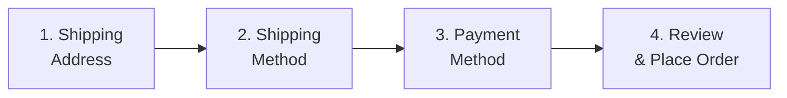
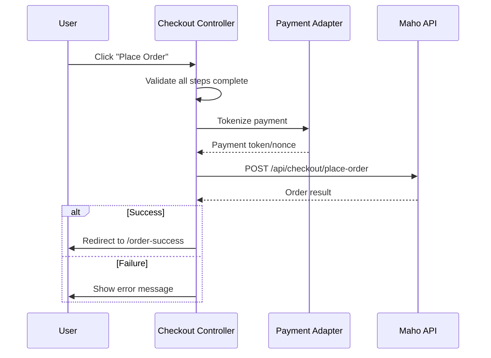

# Checkout Controller

The checkout controller manages the multi-step checkout flow — shipping address, shipping method, payment, and order placement.

**Source:** `src/js/controllers/checkout-controller.js` (~1000 lines)

## Checkout Steps



## Targets

| Target | Element | Purpose |
|--------|---------|---------|
| `step` | Step containers | Show/hide active step |
| `stepIndicator` | Step progress bar | Visual step progress |
| `shippingForm` | Address form | Shipping address inputs |
| `billingForm` | Address form | Billing address inputs |
| `shippingMethods` | Method list | Available shipping options |
| `paymentMethods` | Method list | Available payment options |
| `orderSummary` | Summary panel | Items, totals, applied coupons |
| `placeOrderButton` | Submit button | Final order placement |
| `errorMessage` | Error display | Validation/API errors |

## Values

| Value | Type | Description |
|-------|------|-------------|
| `step` | Number | Current step (1-4) |
| `cartId` | String | Cart/quote ID |
| `isGuest` | Boolean | Guest vs. logged-in checkout |
| `countries` | String (JSON) | Available countries + regions |

## Step 1: Shipping Address

- Form fields: name, street, city, region, postcode, country, phone, email
- Country selection populates region dropdown dynamically
- Saved addresses available for logged-in customers
- Address validation before proceeding

## Step 2: Shipping Method

After address entry:

1. POST address to API to get available shipping methods
2. Display methods with rates (e.g., "Standard - $9.95", "Express - $14.95")
3. User selects a method
4. Totals update with selected shipping cost

## Step 3: Payment

Payment methods loaded from the API. The controller supports:

- **Braintree** — Hosted fields (card number, CVV, expiry) via iframe
- **PayPal** — Redirect to PayPal flow
- **Other** — Extensible payment adapter pattern

Payment adapters are in `src/js/payment-methods/`:

```
payment-methods/
├── base-adapter.js       # Abstract adapter interface
└── braintree-adapter.js  # Braintree hosted fields implementation
```

## Step 4: Review & Place Order

1. Display full order summary (items, shipping, tax, total)
2. Show shipping and billing addresses
3. "Place Order" button triggers order creation
4. On success: redirect to order success page
5. On failure: display error, stay on current step

## Order Placement Flow



## Guest vs. Logged-In

| Feature | Guest | Logged-In |
|---------|-------|-----------|
| Email required | Step 1 | Pre-filled |
| Saved addresses | No | Yes (dropdown) |
| Save address option | No | Checkbox |
| Order history | No | Linked to account |

Source: `src/js/controllers/checkout-controller.js`, `src/js/payment-methods/`
