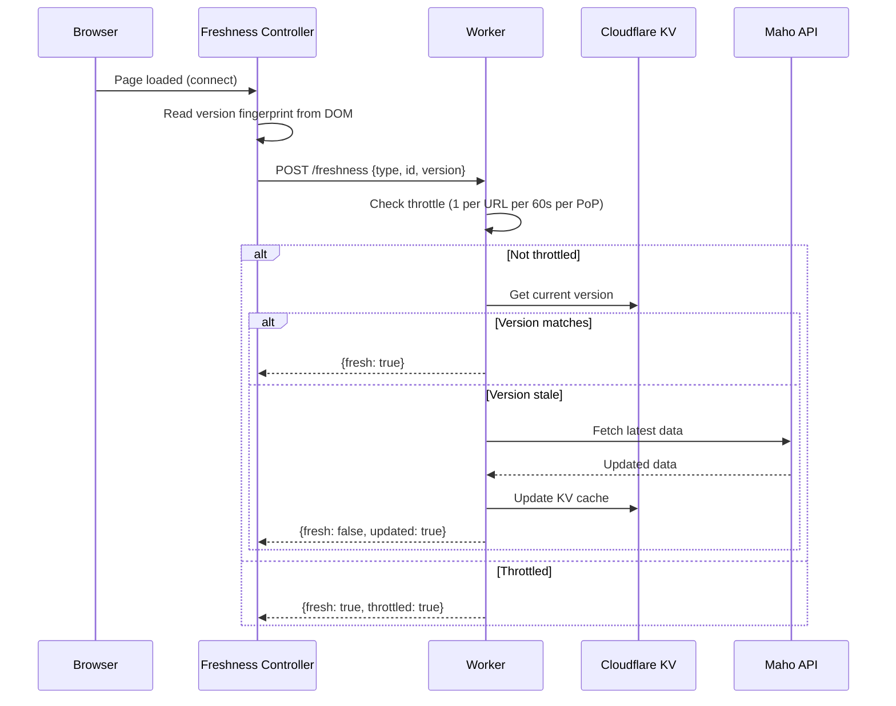

# Freshness Controller

The freshness controller runs in the background on every page load to ensure edge-cached content stays up to date.

**Source:** `src/js/controllers/freshness-controller.js` (~600 lines)

## How Freshness Works



## Version Fingerprints

Each server-rendered page embeds a hidden element with version data:

```html
<div data-controller="freshness"
     data-freshness-type-value="product"
     data-freshness-id-value="tori-tank"
     data-freshness-version-value="abc123def">
</div>
```

The `version` is a hash of the entity's data at render time. If the origin data has changed since rendering, the version won't match.

## Values

| Value | Type | Description |
|-------|------|-------------|
| `type` | String | Entity type (product, category, cms-page, blog-post) |
| `id` | String | Entity identifier (URL key) |
| `version` | String | Data version hash at render time |

## Throttling

To prevent excessive origin API calls, the Worker throttles freshness checks:

- **Per URL:** Maximum 1 revalidation per 60 seconds per PoP
- **Throttle mechanism:** Cloudflare Cache API stores a "last checked" timestamp
- **Result:** Even with thousands of concurrent visitors, each product page triggers at most ~1 origin call per minute globally

## Page Types

| Type | Freshness Checked | What Changes |
|------|-------------------|-------------|
| Product | Price, stock, description | KV product data |
| Category | Product additions/removals | KV category product list |
| CMS Page | Content updates | KV CMS page content |
| Blog Post | Content updates | KV blog post content |
| Homepage | Featured products, promos | KV homepage config |

## Impact on Performance

The freshness controller runs asynchronously after page load — it never blocks rendering. Users see the cached version immediately. If the data is stale, the controller fetches fresh data from the Maho API and **replaces the DOM in-place** — so the current user sees the update without a page reload. Simultaneously, the Worker updates KV and busts the edge cache so the next visitor gets the fresh version server-rendered.

This means content updates propagate to the **current user within seconds**, and to all subsequent visitors within ~60 seconds.

Source: `src/js/controllers/freshness-controller.js`, `src/index.tsx`
