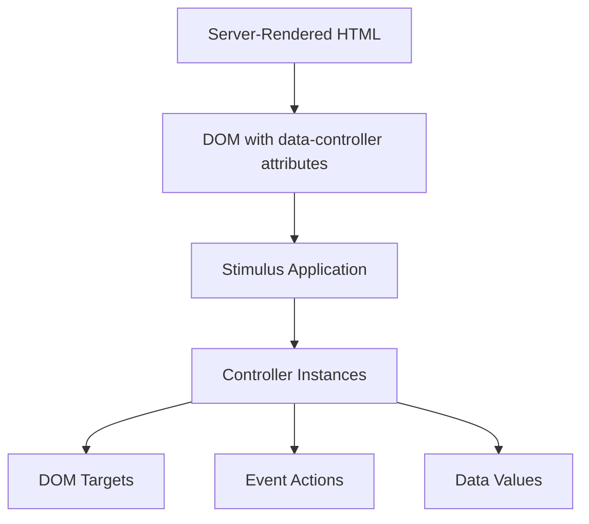

# Stimulus Controllers

The Maho Storefront uses [Hotwire](https://hotwired.dev/) for client-side behaviour - [Turbo](https://turbo.hotwired.dev/) handles SPA-like page transitions (no full reloads between pages), and [Stimulus](https://stimulus.hotwired.dev/) controllers attach interactivity to server-rendered HTML via `data-controller` attributes. There's no client-side framework runtime.

## Architecture



There is no client-side rendering or virtual DOM. The Worker renders complete HTML, and Stimulus controllers add interactivity (cart management, variant selection, filtering, etc.) on top.

## How Stimulus Works

### Controllers

A controller is a JavaScript class that connects to a DOM element:

```html
<div data-controller="product"
     data-product-sku-value="ABC123"
     data-product-variants-value='[...]'>
  <span data-product-target="price">$49.95</span>
  <button data-action="click->product#addToCart">Add to Cart</button>
</div>
```

```javascript
import { Controller } from '../stimulus.js';

export default class extends Controller {
  static targets = ['price'];
  static values = { sku: String, variants: Array };

  addToCart() {
    // Handle add to cart
  }
}
```

### Targets

Named DOM elements the controller can reference:

```javascript
static targets = ['price', 'gallery', 'addButton'];

// Access via:
this.priceTarget      // First matching element
this.priceTargets     // All matching elements
this.hasPriceTarget   // Boolean check
```

### Values

Typed data passed from HTML to the controller:

```javascript
static values = {
  sku: String,
  variants: Array,
  inStock: { type: Boolean, default: true }
};

// Access via:
this.skuValue         // "ABC123"
this.variantsValue    // [...]
this.inStockValue     // true
```

### Actions

Event bindings declared in HTML:

```html
<!-- click event on the element -->
<button data-action="click->product#addToCart">

<!-- input event -->
<input data-action="input->search#query">

<!-- custom event -->
<div data-action="cart:updated->header#refreshBadge">
```

## Controller Inventory

| Controller | File | Lines | Purpose |
|-----------|------|-------|---------|
| product | `product-controller.js` | ~800 | Product detail page: variant selection, gallery, pricing, add to cart |
| checkout | `checkout-controller.js` | ~1000 | Multi-step checkout: shipping, payment, order placement |
| account | `account-controller.js` | ~1100 | Account dashboard: orders, addresses, profile management |
| category-filter | `category-filter-controller.js` | ~900 | Category filtering: sidebar filters, price range, sort, pagination |
| cart | `cart-controller.js` | ~600 | Cart page: item management, quantity updates, coupons |
| cart-drawer | `cart-drawer-controller.js` | ~600 | Slide-out mini cart drawer |
| freshness | `freshness-controller.js` | ~600 | Background freshness checks and revalidation |
| auth | `auth-controller.js` | ~300 | Login, registration, password reset |
| hover-swatch | `hover-swatch-controller.js` | ~300 | Color swatch hover → product image swap |
| search | `search-controller.js` | ~150 | Search bar autocomplete and results |
| review | `review-controller.js` | ~200 | Review submission and rating display |
| wishlist | `wishlist-controller.js` | ~150 | Wishlist add/remove |
| home-carousel | `home-carousel-controller.js` | ~150 | Homepage image carousel |
| size-guide | `size-guide-controller.js` | ~150 | Size guide modal |
| auth-state | `auth-state-controller.js` | ~70 | Auth state persistence |
| mobile-menu | `mobile-menu-controller.js` | ~50 | Mobile navigation drawer |
| contact | `contact-controller.js` | ~100 | Contact form submission |
| newsletter | `newsletter-controller.js` | ~50 | Inline newsletter subscription (footer form) |
| newsletter-popup | `newsletter-popup-controller.js` | ~75 | Modal/dialog newsletter popup with delay + localStorage dismiss |
| newsletter-flyout | `newsletter-flyout-controller.js` | ~75 | Slide-in flyout newsletter card with dismiss + localStorage |
| order-success | `order-success-controller.js` | ~50 | Post-purchase tracking |

## Supporting Libraries

| File | Purpose |
|------|---------|
| `src/js/api.js` | API client wrapper with cart ID management |
| `src/js/utils.js` | `formatPrice()`, `escapeHtml()`, `updateCartBadge()`, `ensureCart()` |
| `src/js/template-helpers.js` | DOM template hydration (`hydrateTemplate()`, `setSlotHtml()`) |
| `src/js/analytics.js` | Event tracking (Google Analytics integration) |

## Bundle

All controllers are bundled into a single file via esbuild:

```bash
bun run build:js
# → public/controllers.js.txt
```

The `.js.txt` extension ensures Cloudflare serves it as a text module (imported into the Worker). The route handler serves it at `/controllers.js` with proper MIME type and 1-year cache headers.

Source: `src/js/controllers/`, `src/js/app.js`
