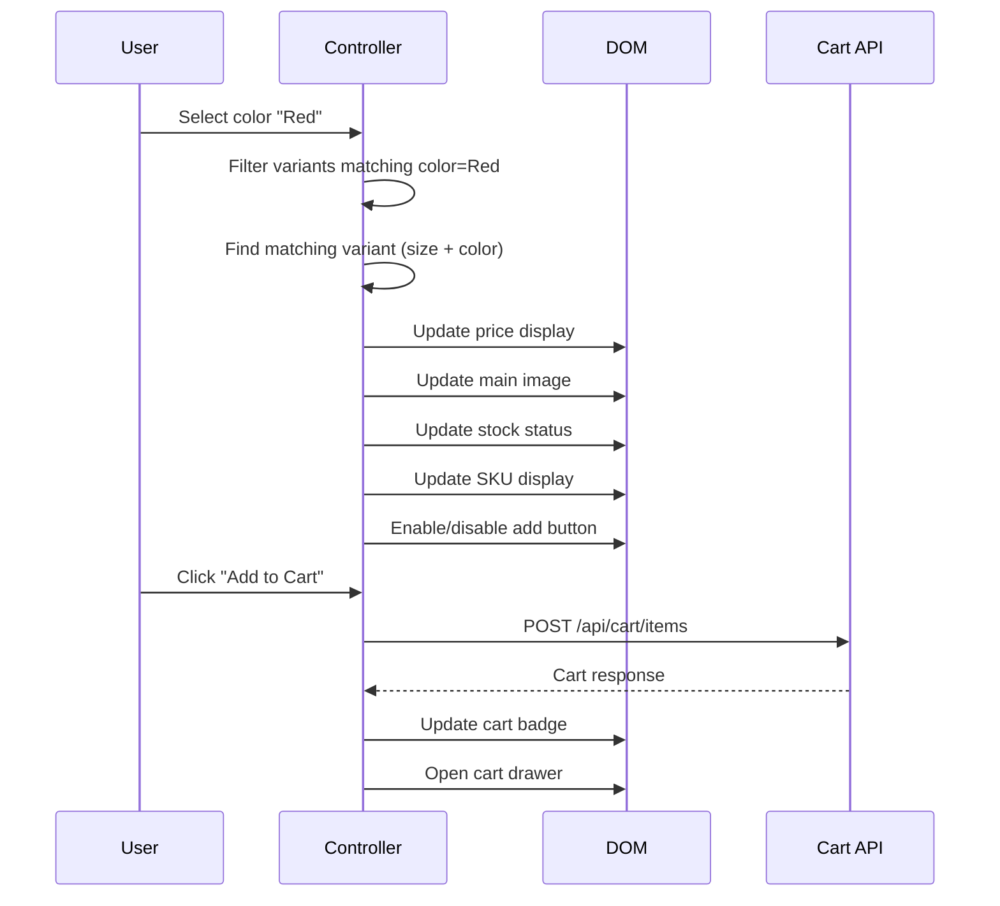

# Product Controller

The product controller manages the product detail page - variant selection, gallery interaction, pricing updates, and add-to-cart functionality.

**Source:** `src/js/controllers/product-controller.js` (~800 lines)

## Targets

| Target | Element | Purpose |
|--------|---------|---------|
| `price` | Price display | Updated when variant changes |
| `addButton` | Add to cart button | Disabled when out of stock |
| `qty` | Quantity input | Quantity selector |
| `gallery` | Image gallery container | Gallery image swapping |
| `mainImage` | Main product image | Updated on variant/swatch selection |
| `thumbnail` | Gallery thumbnails | Active state management |
| `sku` | SKU display | Updated on variant selection |
| `stock` | Stock indicator | In/out of stock messaging |
| `optionSelect` | Option dropdowns/swatches | Configurable product options |

## Values

| Value | Type | Description |
|-------|------|-------------|
| `variants` | String (JSON) | Configurable product variants array |
| `sku` | String | Base product SKU |
| `type` | String | Product type (`simple`, `configurable`, `grouped`, `bundle`, `downloadable`, `virtual`, `giftcard`) |
| `productId` | Number | Product entity ID |
| `mediaGallery` | String (JSON) | Gallery image URLs |

## Actions

| Action | Trigger | Behavior |
|--------|---------|----------|
| `addToCart` | Click add button | POST to cart API, open cart drawer |
| `selectOption` | Change option select/click swatch | Filter available variants, update price/image |
| `updateQty` | Click +/- or input change | Update quantity value |
| `selectThumbnail` | Click thumbnail | Switch main gallery image |
| `zoomImage` | Click main image | Open full-size image overlay |

## Variant Selection Flow



## Configurable Product Handling

For configurable products, the controller:

1. Parses the `variants` value (JSON array of all variant combinations)
2. On each option change, filters to find the matching variant
3. Updates price (variant may have a different price than the parent)
4. Swaps the gallery image if the variant has a unique image
5. Checks stock quantity for the selected variant

```javascript
// Variant data structure
{
  id: 123,
  sku: "PROD-RED-M",
  price: 49.95,
  finalPrice: 39.95,
  stockQty: 5,
  attributes: { color: "Red", size: "M" },
  imageUrl: "/media/catalog/product/red-variant.jpg"
}
```

## Gallery Interaction

- **Thumbnail click** → swaps main image with smooth transition
- **Main image click** → opens zoom overlay (pinch-zoom on mobile)
- **Variant selection** → auto-scrolls to the variant's image in the gallery
- **Keyboard navigation** → arrow keys cycle through gallery images

## Add to Cart

The add-to-cart flow:

1. Validates all required options are selected
2. Ensures quantity > 0 and within stock limits
3. Builds a type-specific request body via a per-type builder (see below)
4. POSTs to `/api/guest-carts/{maskedId}/items` (guest) or the authenticated cart
5. On success: dispatches `cart:updated` custom event, opens cart drawer
6. On error: displays inline error message

### Per-type body builders

`add()` dispatches to a table of private builders keyed by `typeValue`. Each
builder reads its inputs from the DOM (`data-*` attributes wired by the
`ProductOptions` components — see [product-display components](../components/product-display.md#product-options)),
validates required fields, and mutates the outgoing `body` in place.

| Type | Builder | Fields set on body |
|---|---|---|
| `configurable` | `_buildConfigurableBody` | `sku` (resolved child variant SKU) |
| `grouped` | `_buildGroupedBody` | `sku`, `superGroup` (childId → qty) |
| `bundle` | `_buildBundleBody` | `sku`, `bundleOption`, `bundleOptionQty` |
| `downloadable` | `_buildDownloadableBody` | `sku`, `links` |
| `giftcard` | `_buildGiftcardBody` | `sku`, `giftcardAmount`, `giftcardSenderName`/`Email`, `giftcardRecipientName`/`Email`, optional `giftcardMessage` + `giftcardDeliveryDate` |
| `simple` / `virtual` | (default) | `sku` |

Two shared helpers run for every type after the type-specific builder:

- `_appendCustomOptions(body)` — reads `[data-custom-option-id]` inputs, sets
  `body.options = { optionId: valueId }`.
- `_appendOptionFiles(body)` — reads `[data-custom-option-file-id]` inputs,
  base64-encodes each file, sets `body.options_files`.

All keys are **camelCase** on the wire — the API-Platform DTO
(`Mage_Checkout_Api_CartProcessor::addItemToCart`) converts them to snake_case
for Maho's internal buy request. Sending `bundle_option` etc. from the client
is silently dropped.

Source: `src/js/controllers/product-controller.js`
