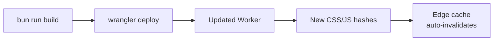

# Deployment

The Maho Storefront deploys to Cloudflare Workers. A deployment updates the Worker code and static assets — catalog data is managed separately via sync.

## Quick Deploy

```bash
# Build assets + deploy Worker
bun run build && bun run deploy
```

Or use the deploy script for demo environments:

```bash
./deploy.sh
```

## Deployment Steps



### 1. Build Assets

```bash
bun run build
```

Generates `public/styles.css` and `public/controllers.js.txt`. These are embedded in the Worker as text modules — no separate asset upload needed.

### 2. Deploy Worker

```bash
bun run deploy
# Runs: wrangler deploy
```

Wrangler uploads the Worker with all bundled assets to Cloudflare. The deployment is instant and zero-downtime — the new Worker handles requests immediately.

### 3. Sync Data (if needed)

If the deployment includes changes to data handling, trigger a sync:

```bash
curl -X POST https://your-store.com/sync \
  -H "Content-Type: application/json" \
  -d '{"secret": "your-sync-secret"}'
```

### 4. Purge Edge Cache (optional)

Normally unnecessary — the `ASSET_HASH` change automatically invalidates edge caches. For immediate propagation:

```bash
curl -X POST "https://api.cloudflare.com/client/v4/zones/{ZONE_ID}/purge_cache" \
  -H "Authorization: Bearer {API_TOKEN}" \
  -H "Content-Type: application/json" \
  -d '{"purge_everything": true}'
```

## Environment Configuration

### wrangler.toml

```toml
name = "maho-storefront"
main = "src/index.tsx"
compatibility_flags = ["nodejs_compat"]

[vars]
MAHO_API_URL = "https://your-maho-instance.com"
SYNC_SECRET = "your-secret"

[[kv_namespaces]]
binding = "CONTENT"
id = "your-kv-namespace-id"
```

### Multiple Environments

Use separate wrangler configs for staging vs. production:

```bash
# Production
wrangler deploy

# Staging
wrangler deploy --config wrangler.staging.toml

# Demo
wrangler deploy --config wrangler.demo-only.toml
```

## Zero-Downtime Deployments

Cloudflare Workers deployments are inherently zero-downtime:

1. New Worker is uploaded and compiled
2. Cloudflare atomically switches traffic to the new version
3. In-flight requests on the old version complete normally
4. Old cached pages continue serving until edge cache expires

The `ASSET_HASH` ensures old pages reference old asset URLs (still cached for 1 year), while new pages reference new URLs. No asset conflicts possible.

## CI/CD Integration

Example GitHub Actions workflow:

```yaml
name: Deploy
on:
  push:
    branches: [main]
jobs:
  deploy:
    runs-on: ubuntu-latest
    steps:
      - uses: actions/checkout@v4
      - uses: actions/setup-node@v4
        with:
          node-version: 20
      - run: bun install
      - run: bun run build
      - run: bunx wrangler deploy
        env:
          CLOUDFLARE_API_TOKEN: ${{ secrets.CF_API_TOKEN }}
```

Source: `wrangler.toml`, `deploy.sh`, `package.json`
