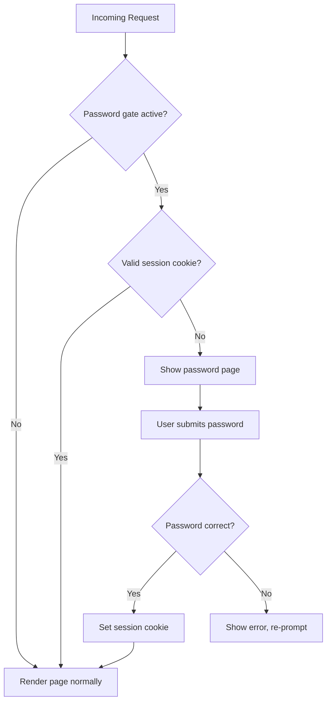

# Password Gate

The storefront includes a password gate that restricts access to the entire site. When enabled, visitors must enter a password before they can browse. This is useful for staging, pre-launch, or client-preview environments.

## How It Works



When enabled, all page requests (except static assets, API routes, and the dev login) are intercepted by middleware. The visitor sees a full-screen password prompt. After entering the correct password, a session cookie is set and they can browse normally.

## Configuration

The password gate is controlled by two KV keys in the `CONTENT` namespace:

| KV Key | Type | Description |
|--------|------|-------------|
| `config:password_gate` | boolean | `true` to enable, `false` to disable |
| `config:storefront_password` | string | The password visitors must enter |

### Enable the Password Gate

```bash
npx wrangler kv key put --namespace-id=YOUR_KV_ID "config:password_gate" "true"
npx wrangler kv key put --namespace-id=YOUR_KV_ID "config:storefront_password" "your-secret-password"
```

### Disable the Password Gate

```bash
npx wrangler kv key put --namespace-id=YOUR_KV_ID "config:password_gate" "false"
```

## Excluded Routes

The following routes bypass the password gate and are always accessible:

- `/styles.css`, `/controllers.js` - static assets
- `/api/*` - API endpoints
- `/sync/*`, `/cache/*` - data sync and cache management
- `/dev/login`, `/dev/logout`, `/dev/preview` - dev toolbar routes
- `/media/*`, `/public/*` - media files
- `/sitemap*`, `/robots.txt`, `/favicon.ico` - SEO files

## Relationship to Dev Toolbar

The password gate and dev toolbar are **independent systems**:

- **Password gate** blocks all visitors until they enter the store password. It's a visitor-facing access control.
- **Dev toolbar** provides developer tools (performance metrics, cache management, theme switching) and requires a separate dev token login at `/_dev/login`.

You can have any combination:

| Password Gate | Dev Toolbar | Use Case |
|--------------|-------------|----------|
| On | On | Pre-launch: locked site, devs get toolbar |
| Off | On | Public site, devs get toolbar via `/_dev/login` |
| On | Off | Password-only access, no dev tools |
| Off | Off | Fully public, no dev tools |

The dev toolbar requires `DEV_SECRET` to be set in `wrangler.toml`. If not set, the toolbar system is completely disabled.

## Security

- Passwords are compared using constant-time comparison to prevent timing attacks
- Session cookies are HMAC-signed with the `DEV_SECRET`
- Sessions expire after 7 days

Source: `src/dev-auth.ts`, `src/index.tsx`
