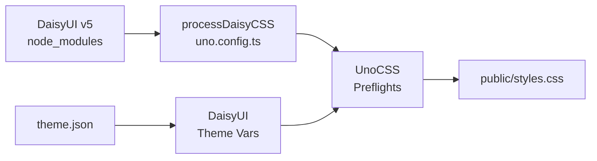

# DaisyUI v5 Integration

The Maho Storefront uses [DaisyUI v5](https://daisyui.com/) as its component CSS library, integrated via UnoCSS preflights rather than Tailwind.

## Architecture



### Why UnoCSS Instead of Tailwind?

DaisyUI v5 is designed for Tailwind CSS v4. The storefront uses UnoCSS instead because:

- **Faster builds** - UnoCSS is significantly faster than Tailwind
- **More flexible** - Custom preflights, rules, and shortcuts
- **Smaller output** - Only generates used utility classes

### CSS Processing

The `processDaisyCSS()` function in `uno.config.ts` handles DaisyUI's CSS:

1. Reads the full DaisyUI CSS from `node_modules/daisyui/daisyui.css`
2. Strips `@layer` directives (UnoCSS manages layers differently)
3. Flattens bare `&{...}` blocks using stack-based phantom brace tracking
4. Preserves meaningful nesting (`&:hover`, `&>.child`, `&:focus-visible`)
5. Outputs clean CSS as a UnoCSS preflight

## Theme Variable Mapping

DaisyUI uses its own CSS variable naming. `uno.config.ts` maps `theme.json` tokens to DaisyUI's system:

| theme.json Token | DaisyUI Variable | Used By |
|-----------------|------------------|---------|
| `accent` | `--color-primary` | `btn-primary`, `bg-primary`, `text-primary` |
| `primary` | `--color-secondary` | `btn-secondary`, `bg-secondary` |
| `bg` | `--color-base-100` | `bg-base-100` |
| `bgSubtle` | `--color-base-200` | `bg-base-200` |
| `bgMuted` | `--color-base-300` | `bg-base-300` |
| `text` | `--color-base-content` | Default text color |
| `success` | `--color-success` | `alert-success`, `badge-success` |
| `warning` | `--color-warning` | `alert-warning` |
| `error` | `--color-error` | `alert-error`, `text-error` |
| `info` | `--color-info` | `alert-info` |

::: warning Important
DaisyUI's `primary` is the storefront's `accent` color. This reversal is intentional - the most visually prominent elements (buttons, links, badges) should use the accent/CTA color.
:::

## DaisyUI v5 Component Patterns

### Forms

DaisyUI v5 uses a different form pattern than v4:

```html
<!-- v5 Pattern: fieldset + fieldset-legend -->
<fieldset class="fieldset">
  <legend class="fieldset-legend">Email</legend>
  <label class="input w-full">
    <input type="email" class="grow" placeholder="you@example.com" />
  </label>
</fieldset>

<!-- Select -->
<select class="select w-full">
  <option>Choose one</option>
</select>
```

::: warning
Do NOT use DaisyUI v4 patterns (`form-control`, `label-text`). These don't exist in v5.
:::

### Buttons

```html
<button class="btn btn-primary">Primary</button>
<button class="btn btn-secondary">Secondary</button>
<button class="btn btn-outline">Outline</button>
<button class="btn btn-ghost">Ghost</button>
```

### Tabs

DaisyUI v5 uses `tabs-border` (not v4's `tabs-bordered`), and `tab-active` (not just `active`):

```html
<div class="tabs tabs-border">
  <button class="tab tab-active">Tab 1</button>
  <button class="tab">Tab 2</button>
</div>
```

### Cards

```html
<div class="card bg-base-100 shadow-md">
  <figure></figure>
  <div class="card-body">
    <h2 class="card-title">Title</h2>
    <p>Description</p>
    <div class="card-actions justify-end">
      <button class="btn btn-primary">Action</button>
    </div>
  </div>
</div>
```

## Base Reset Gotchas

The UnoCSS base reset must exclude DaisyUI's button classes from generic button resets:

```css
button:not(.btn):not(.tab):not([class*="join-item"]) {
  /* Reset styles only for non-DaisyUI buttons */
}
```

This prevents DaisyUI's styled buttons from being stripped of their styles.

Source: `uno.config.ts`
