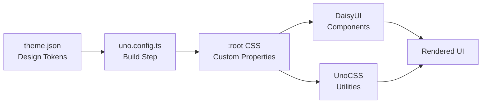

# Theming

The Maho Storefront uses a JSON-driven theming system where design tokens defined in `theme.json` are transformed into CSS custom properties at build time. Combined with DaisyUI v5's semantic class system and UnoCSS utilities, themes can be created and switched without writing any CSS.

## How It Works



1. **Define tokens** in `theme.json` - colors, fonts, spacing, radii, shadows
2. **Build step** reads tokens and generates CSS custom properties in `:root`
3. **DaisyUI components** consume semantic color tokens (`--color-primary`, etc.)
4. **UnoCSS utilities** use the same tokens for consistency
5. **Multi-theme** support via `[data-theme]` CSS scoping

## Theme Files

| File | Purpose |
|------|---------|
| `theme.json` | Default theme (required) |
| `theme-{name}.json` | Additional themes (e.g., `theme-tech.json`) |
| `stores.json` | Maps store codes to theme files |
| `uno.config.ts` | Transforms tokens → CSS |

## Token Categories

| Category | Examples | Count |
|----------|----------|-------|
| Colors | `primary`, `accent`, `bg`, `text` | ~30 |
| Fonts | `sans`, `heading`, `mono` | 3 |
| Typography | `baseFontSize`, `h1Size`, `headingWeight` | ~11 |
| Space | `0` through `24` (0px–96px) | ~24 |
| Breakpoints | `sm` through `2xl` | 5 |
| Sizes | `headerHeight`, `contentMax`, `drawerWidth` | ~24 |
| Radii | `xs` through `full` | 7 |
| Shadows | `xs` through `xl` | 5 |
| Transitions | `fast`, `base`, `slow` | 3 |
| Components | Button, card, badge, input radii/styles | ~12 |

## Themes in Action

The same storefront codebase with different `theme.json` tokens:

| Default (Fashion) | Tech Theme |
|:--:|:--:|
|  |  |

## Multi-Theme Architecture

Each store in `stores.json` references a theme file. At build time, UnoCSS generates CSS for all themes:

```css
/* Default theme */
:root {
  --color-primary: #111111;
  --color-accent: #ff2d87;
  /* ... */
}

/* Tech theme */
[data-theme="tech"] {
  --color-primary: #0a0a0a;
  --color-accent: #00d4ff;
  /* ... */
}
```

Runtime switching: `document.documentElement.setAttribute('data-theme', 'tech')`

## Next Steps

- [theme.json Reference](/theming/theme-json) - full token documentation
- [Creating a Theme](/theming/creating-a-theme) - step-by-step guide
- [CSS Properties](/theming/css-properties) - generated CSS variable mapping
- [DaisyUI Integration](/theming/daisyui) - how DaisyUI v5 is integrated
